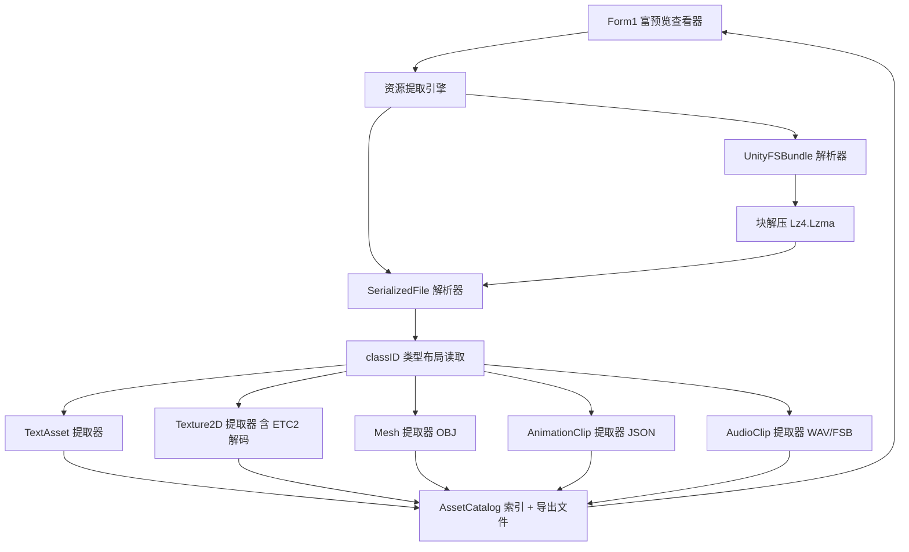

## 用户需求

使用 VB.NET 在 `g:/UnityViewer/UnityViewer/` 项目中新增一个 Unity 资源提取模块，从 Unity 游戏资源文件中提取模型、贴图/图片、人物动作、音乐、文本等资源，用于重建游戏；提取结果在 `Form1.vb` 窗体中查看。完成后需用两个安卓游戏文件夹实测：

- `Z:\klsdzj_4.11.1_1_20181220_141000_676167`
- `Z:\klsdzj_4.15.1_20190428_025416_686ef`

用户已确认查看界面要达到“含图片/文本富预览”级别。

## 产品概述

一个 Windows 桌面工具，选择安卓游戏解包后的文件夹后，自动解析其中的 Unity 资源容器（SerializedFile 与 UnityFS 资源包），按类别（贴图、模型、动画、音频、文本等）列出资源，支持图片预览、文本全文预览、Mesh/动画结构化信息查看，并可一键导出到磁盘目录，用于游戏资源重建。

## 核心功能

- 解析 Unity 5.6.4p3 的 SerializedFile（format 17）与 UnityFS 资源包（LZ4/LZMA 压缩）。
- 提取并导出：文本(TextAsset)、贴图/图片(Texture2D/Sprite)、模型(Mesh→OBJ)、人物动作(AnimationClip)、音乐(AudioClip)。
- 处理外置资源：4.11.1 的 `.resource` 外部流文件，以及 4.15.1 资源包内嵌资源。
- Form1 富预览查看器：左侧资源树（来源→类型→资源名），右侧图片预览/文本全文/结构化信息/元信息多标签。
- 支持“选择文件夹、开始提取、导出选中、导出全部”，结果默认输出到 `<游戏文件夹>_extracted\` 按类型分子目录。

## 技术栈

- 语言/框架：VB.NET + .NET 10 (net10.0-windows) + Windows Forms（现有 `UnityViewer.vbproj` 已是 WinForms，直接扩展）。
- 解压复用：用户指定的 `G:\GCModeller\...\LZ77Stream` 模块中的 `Lz4.vb`（块解码 `Lz4.DecodeBlock`）、`Lzma1Decoder.vb`/`Lzma.vb`/`LzmaStream.vb`（LZMA alone 解码）。不引入额外 NuGet 依赖。
- 图像处理：`System.Drawing.Bitmap` 保存 PNG；纹理解码（RGBA/RGB/ETC2）自行实现为像素数组。
- 无第三方库，全部纯 VB.NET。

## 实现方案

### 总体策略

构建“资源提取引擎 + Form1 查看器”两层结构。引擎先定位游戏文件夹下的所有资源容器（`.assets` 与 `assets/Android/*` 资源包），逐个解析出对象表，再按 `classID` 硬编码的 Unity 5.6 类型布局读取对象字段并提取为文件。

### 关键技术决策

1. **TypeTree 剥离，改用 classID 硬编码布局**：实测 4.11.1 的 `.assets` 中不含类型名字符串，确认 release 构建已剥离 TypeTree（`enableTypeTree=false`），类型表仅存 `classID`+hash。因此放弃通用 TypeTree 遍历，改用按 `classID` 预定义各类型字段读取顺序（Texture2D=28、AudioClip=83、Mesh=43、AnimationClip=74、TextAsset=49、Sprite=213 等），这是唯一可靠路径。
2. **UnityFS 块解压复用现有模块**：Unity 的 LZ4/LZ4HC 块用 `Lz4.DecodeBlock(compressed, decompressedSize)`；LZMA 块（5 字节 props+字典 + 流）在前面补 8 字节 LE 大小头拼成 alone 流后交给 `Lzma.Decompress`。不引用 `Lz4Stream.vb`（帧格式且依赖 XxHash32）。
3. **端序处理**：SerializedFile 头部字段为**大端** Int32，其后元数据/对象数据为**小端**；UnityFS 头部混合、BlocksInfo 为**大端**。统一用可切换端序的 `EndianBinaryReader` 处理。
4. **外置资源（StreamedResource）**：Texture2D/AudioClip 的字节可能外置于 `.resource` 文件或资源包内资源，通过 `m_Resource`（m_Source/m_Offset/m_Size）寻址读取。

### 性能与可靠性

- 大资源包（4.15.1 单包数 MB~数十 MB）采用“按需解压到 MemoryStream”而非全量落盘，控制内存峰值。
- 纹理解码为 O(宽×高) 单遍扫描，避免二次分配。
- 解析失败的类型不中断整体流程：记录错误并导出原始字节（`.bin`）兜底，保证“能提多少提多少”。
- 所有文件读取使用 `Using`/流释放，避免句柄泄漏。

## 实现要点（防止返工）

- 复制 `Lz4.vb/Lzma1Decoder.vb/Lzma.vb/LzmaStream.vb` 到项目 `Compression\`，并在 vbproj `<Compile Include>`；忽略 `Lz4Stream.vb`、`LzmaSpec.cpp`、`NamespaceDoc.vb`。
- 当前 vbproj `StartupObject=Sub Main` 但缺 Main：新增 `Module Program` 的 `Sub Main` 调用 `Application.Run(New Form1)`，注意 `Application.EnableVisualStyles` 与高 DPI。
- UnityFS 头部 `unityVersion`/`unityRevision` 字符串偏移需用 4.15.1 样本逐步校正（存在 1 字节长度前缀现象），解析后以“解出的 BlocksInfo 是否含 `CAB-` 目录名”作为正确性校验。
- LZMA 复用前确认：Unity LZMA 块前面补的 8 字节大小用该块 `uncompressedSize`，未知则填 `0xFFFFFFFFFFFFFFFF`。

## 架构设计



## 目录结构

```
UnityViewer/
├── Compression/                         # [复制] 复用现有解压模块
│   ├── Lz4.vb                           # [复制] LZ4 块解码 (Lz4.DecodeBlock)
│   ├── Lzma1Decoder.vb                  # [复制] LZMA1 解码核心
│   ├── Lzma.vb                          # [复制] Lzma.Decompress 封装
│   └── LzmaStream.vb                    # [复制] LZMA alone 流
├── UnityAssets/                         # [新建] 资源提取引擎
│   ├── EndianBinaryReader.vb            # [NEW] 可切换大/小端读取器 + Unity 字符串/PPtr 读取
│   ├── UnityFSBundle.vb                 # [NEW] UnityFS 头部/BlocksInfo/块解压/目录解析
│   ├── SerializedFile.vb                # [NEW] SerializedFile 头部/类型表/对象表解析
│   ├── AssetTypeLayouts.vb              # [NEW] classID→类型字段布局定义与读取辅助
│   ├── AssetExtractors.vb              # [NEW] 各类型提取逻辑（Text/Texture/Mesh/Anim/Audio）
│   ├── TextureDecoders.vb              # [NEW] RGBA/RGB/ETC2 等格式→Bitmap 解码
│   ├── ModelExporter.vb                 # [NEW] Mesh→OBJ 写出
│   └── AssetCatalog.vb                  # [NEW] 资源索引数据模型（供 Form1 绑定）
├── Program.vb                           # [NEW] Sub Main 启动窗体
├── Form1.vb                             # [MODIFY] 富预览查看界面逻辑
├── Form1.Designer.vb                    # [MODIFY] 窗体布局（SplitContainer/TreeView/TabControl 等）
└── UnityViewer.vbproj                   # [MODIFY] 增加 Compile Include（Compression/UnityAssets 文件）
```

## 关键代码结构（可选）

- `EndianBinaryReader`：暴露 `ReadInt32BE/ReadInt32LE/ReadInt64/ReadStringToNull/ReadPPtr`，封装端序切换。
- `AssetEntry`（在 `AssetCatalog.vb`）：持有 classID、类型名、pathID、来源文件/包、大小、提取函数委托，供 TreeView 与导出复用。
- `ExtractResult`：含成功标志、输出路径、预览数据（Bitmap 或文本或结构化信息），供 Form1 多标签展示。

## 设计风格

采用专业深色工具风（Dark Tooling），契合资源提取/逆向重建类桌面工具的氛围；以蓝青色作为强调色，配合清晰分层与轻量微交互（TreeView 选中高亮、Tab 切换、按钮悬停态）。整体桌面端布局，非网页放大版。

## 布局与区块（自上而下）

- **顶部 ToolStrip**：按钮“选择游戏文件夹”（默认预填两个给定路径下拉）、“开始提取”、“导出选中”、“导出全部”，右侧显示进度文本与进度条。
- **主体 SplitContainer（左右）**：
- 左：TreeView，三级分组“来源包/文件 → 资源类型（贴图/模型/动画/音频/文本/其他）→ 资源名”，带类型图标与选中高亮。
- 右：TabControl 四页：

    1. 图片预览：PictureBox（Zoom 模式）显示选中贴图 PNG，底部显示尺寸/格式。
    2. 文本预览：RichTextBox 显示 TextAsset 全文（只读、自动换行、等宽字体）。
    3. 结构化信息：ListView/PropertyGrid 展示 Mesh（顶点数、三角形数、子网格数）与 AnimationClip（轨道数、时长、采样率）等解析信息。
    4. 元信息：DataGridView 显示 classID、pathID、大小、来源文件、压缩方式等。

- **底部状态栏**：当前文件夹、已提取总数、各类别计数、错误计数。

## 交互与响应式

- TreeView 选中即刷新右侧预览（图片/文本/结构化信息按类型自动切到对应 Tab）。
- 大资源懒加载：预览仅在选中时提取，避免一次性解码全部贴图导致卡顿。
- 导出按类型分目录（Textures/Models/Audio/Animations/Text/Others）。